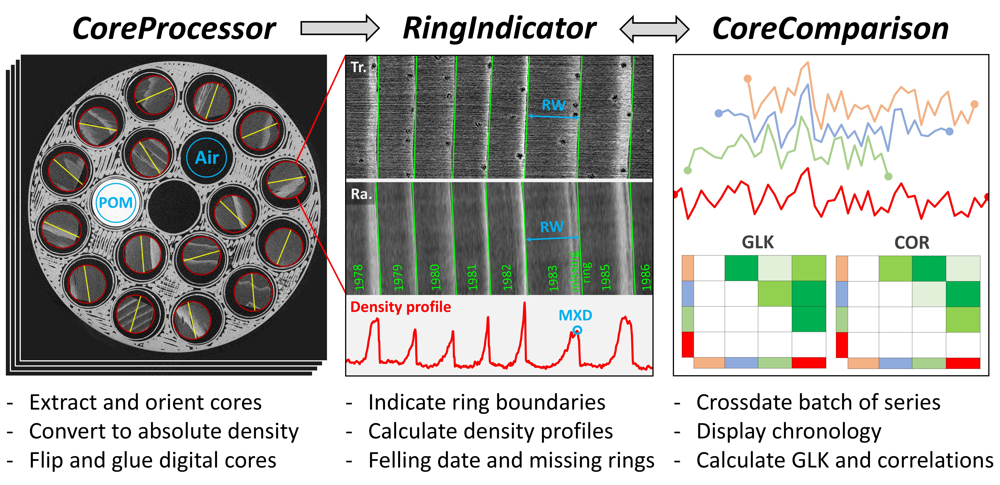

  

    <h1 align="center">XCT Toolchain</h1>

[Matskovsky, Vladimir](https://orcid.org/0000-0002-3771-239X)[^aut][^cre][^UG-WL];
[Verschuren, Louis](https://orcid.org/0000-0002-3102-4588)[^aut][^UG-WL];
[De Mil, Tom](https://orcid.org/0000-0001-6207-9613)[^aut][^TERRA];
[Van den Bulcke, Jan](https://orcid.org/0000-0003-2939-5408)[^aut][^UG-WL]

[^aut]: author
[^cre]: contact person
[^UG-WL]: UGent‐Woodlab, Ghent
[^TERRA]: Forest Is Life, TERRA Teaching and Research Centre, Gembloux

This is the repository for the in-house developed XCT Toolchain software suite (compiled versions), based on MATLAB. It consists of three executable programs: CoreProcessor, which extracts individual cores from scans and converts them to absolute density values; RingIndicator, designed for semi-automatic ring indication and density profile calculation; and CoreComparison, which facilitates cross-dating. The packages are compiled for Microsoft Windows, and require the free installation of [MATLAB Runtime](https://mathworks.com/products/compiler/matlab-runtime.html) (currently version 2024b). The output of indications and density profile calculations are in txt format and can be loaded and manipulated in R using the [XCT.Read](https://github.com/UGent-Woodlab/XCT.read-R-function/) function. More info, [a comprehensive written manual](https://dendrochronomics.ugent.be/downloads/XCT%20Toolchain%20written%20manual.pdf), and [video manuals](https://dendrochronomics.ugent.be/#manual) are available for free at [our site](https://dendrochronomics.ugent.be) and in [this paper](https://doi.org/10.1016/j.dendro.2025.126343).

#####  Table of Contents

- [ CoreProcessor](#corecrocessor)
- [ RingIndicator](#ringindicator)
- [ CoreComparison](#corecomparison)
- [ Excel Templates](#exceltemplates)
- [ Getting Started](#getting-started)
- [ Cite our work](#cite-our-work)
- [ License](#license)

---

## CoreProcessor
CoreProcessor extracts image volumes of individual samples from scans, orients them according to the vertical fiber direction, and converts them to absolute density values. Since reconstructed XµCT scans in our setup can exceed 300 GB, it is time-consuming and often impractical to load these entire scans into memory. To address this, cores are extracted using a slice-by-slice method. First, 100 evenly spaced slices of the scan are averaged and plotted for manual annotation of locations of the samples and reference pairs. The fiber orientation of each sample is also marked manually. The software then automatically processes each indicated sample by extracting, rotating, and converting it slice-by-slice. Initially, reference curves are generated by extracting the POM and air reference pairs from each slice. Then, based on available RAM, the program processes a part of the samples, extracting and converting them in batches until all cores in the scan are completed. This approach eliminates the need to load the entire scan into memory at once.

The extraction process also supports the assignment of different air and POM reference pairs to various groups of increment cores. This feature is particularly useful for mitigating the effects of beam hardening, especially in larger sample holders.

The file type for extracted cores is signed int16 multi-page BigTIFF. The traditional Tagged Image File Format (TIFF) is limited to a maximum file size of about 4 GB. In contrast, the BigTIFF format allows for files up to 16 Exabytes. Using this format is necessary as long cores scanned at 15 µm resolution frequently exceed the 4 GB limit of regular TIFF. Additionally, the use of signed int16 was implemented to accommodate negative density values. Negative density measurements can, for example, occur in samples with large vessels, where the air inside the vessels has an approximate density of zero. Due to noise, the measured density of air follows a normal distribution around zero. Changing the negative values to zero would overestimate the total density of the sample as only the positive part of the distribution would be retained. The software also uses TIFF tags to define voxel size (resolution), ensuring that the images can be universally understood by other software packages. This, for example, enables easy image manipulation in programs like [Fiji](https://imagej.net/software/fiji/). The density value -9999 is used as the NA value, these voxels are automatically removed from the subsequent processing chain by RingIndicator. This is for example useful when certain parts of a sample need to be excluded from the density profile. 

---

## RingIndicator
RingIndicator is used to indicate ring boundaries and calculate density profiles. It is custom-made to work with XµCT images but can also be used to measure optical RGB, anatomical masks, multi-spectral images, or any other TIFF image format. Ring boundaries are indicated as lines, both on the transverse and the radial plane of the 3D digital increment core. The indication process is semi-automatic, as borders can be automatically detected using peaks and valleys in the density profile. For each sample, a continuous density profile along the whole length of the core is calculated which accounts for the 3D orientation of the ring boundaries. The user can set the size of the cross-sectional area along which the profile density is calculated, as well as an optional filter to remove lower density values (useful for MXD studies). Automatic batch calculation of density profiles with different settings afterward is also an option. The program can handle missing rings, and fractures in a core that should not be included in the density profile. There is also an option to display an average of multiple slices that accounts for the orientation of the ring borders. This is particularly useful when handling extremely narrow rings or very noisy scans. All indication data and density profiles are saved as .txt files, that accompany the digital core.  

---

## CoreComparison
CoreComparison facilitates cross-dating by displaying ring-width curves of indicated cores and optional reference chronologies. When changes are made in RingIndicator, such as adjusting indications or the felling date, these updates will be reflected in CoreComparison by pressing the refresh button. It also calculates inter-series gleichläufigkeit (GLK) and correlation statistics between all loaded series. 

---

## Excel Templates
Excel files are used to indicate which samples, what voxel size, and what reference pair configuration was used for each scan. this info is loaded in CoreProcessor and used to export individual digital increment cores. Three examples are given, one with one reference pair (15micronTemplate.xlsx), and two with multiple reference pairs (30micronTemplate.xlsx, 60micronTemplate.xlsx). These correspond to the sample holders and scan settings presented in [this paper](https://doi.org/10.1016/j.dendro.2025.126343). 

---

## Getting started
- These packages are compiled for windows and require the free installation of [MATLAB Runtime](https://mathworks.com/products/compiler/matlab-runtime.html) (currently version 2024b). 
- The output of indications and density profile calculations are in txt format and can be loaded and manipulated in R using the [XCT.Read](https://github.com/UGent-Woodlab/XCT.read-R-function/) function.
- More info, [a comprehensive written manual](https://dendrochronomics.ugent.be/downloads/XCT%20Toolchain%20written%20manual.pdf), and [video manuals](https://dendrochronomics.ugent.be/#manual) are available for free at [our site](https://dendrochronomics.ugent.be) and in [this paper](https://doi.org/10.1016/j.dendro.2025.126343).
- Sample scans can be downloaded on [Zenodo](https://doi.org/10.5281/zenodo.14824998)

---

## Cite our work

You can find the paper where the entire pipeline is described [here](https://doi.org/10.1016/j.dendro.2025.126343). Please cite the following papers when using our toolchain or software: [Van den Bulcke et al. 2014](https://doi.org/10.1016/j.dendro.2013.07.001), [De Mil et al. 2016](https://doi.org/10.1093/aob/mcw063), [Van den Bulcke et al. 2019](https://doi.org/10.1093/aob/mcz126), [De Mil and Van den Bulcke 2023](https://dx.doi.org/10.3791/65208), and [Verschuren et al. 2025](https://doi.org/10.1016/j.dendro.2025.126343).

When using the software, also cite the proper Zenodo DOI: [XCT Toolchain compiled packages](https://doi.org/10.5281/zenodo.14677732) and [XCT.Read R function](https://doi.org/10.5281/zenodo.14654939). 

A bib file of all these can be downloaded [here](https://dendrochronomics.ugent.be/downloads/HowToCite.bib).

---

##  License

This software is protected under the [GNU AGPLv3](https://choosealicense.com/licenses/agpl-3.0/) license. 

---
